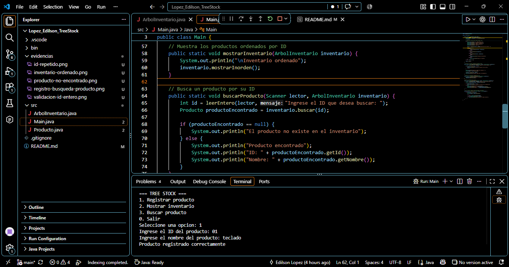
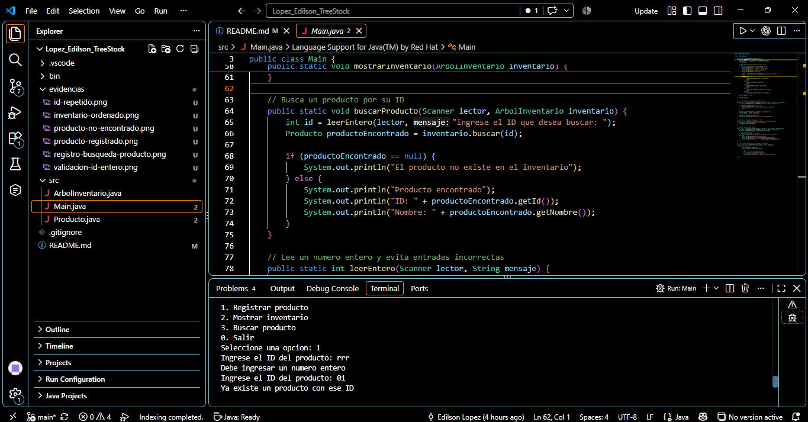
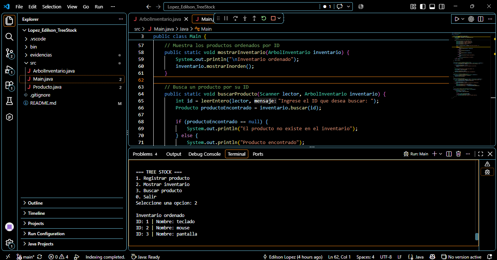
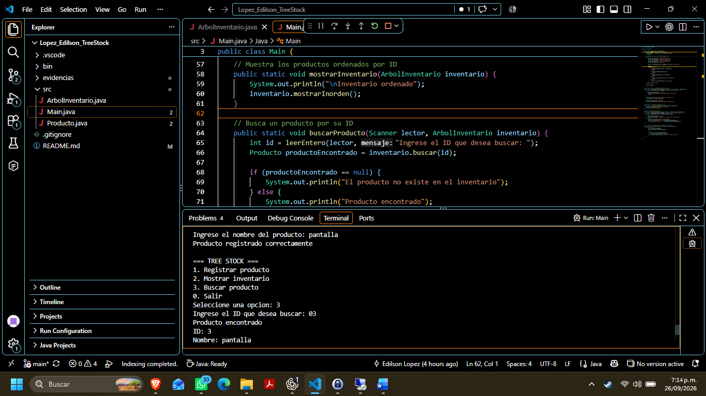
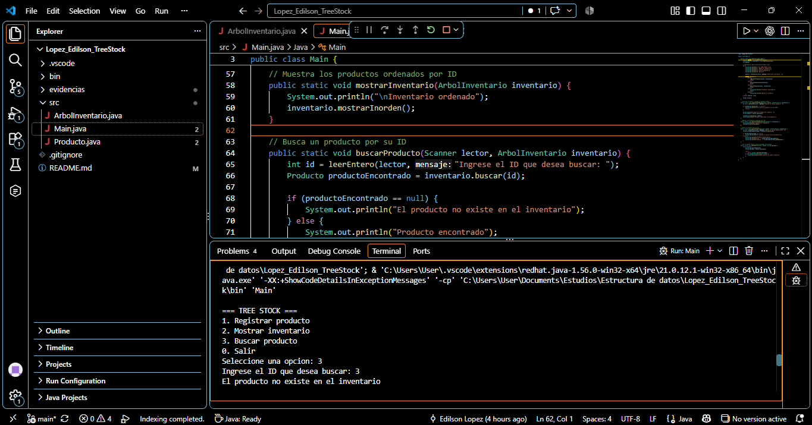
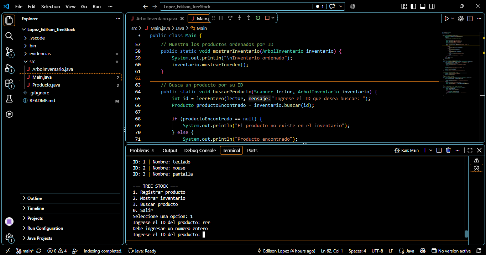

# Tree Stock

**Estudiante:** Edilson Lopez  
**Evidencia de aprendizaje:** Manipulación de árboles en Java

## Objetivo

Desarrollar un sistema de inventario en Java que permita registrar buscar y mostrar productos mediante un árbol binario de búsqueda construido manualmente

## Descripción

Tree Stock es una aplicación de consola que organiza productos utilizando su ID como criterio de ubicación Cada producto funciona como un nodo y contiene una referencia hacia un producto izquierdo y otro derecho

El programa permite registrar productos mostrar el inventario ordenado buscar productos por ID y mantener el menú activo hasta que el usuario decida salir

## Árbol binario de búsqueda

Un árbol binario de búsqueda es una estructura dinámica formada por nodos Cada nodo puede tener como máximo dos hijos

- Los ID menores se ubican en el lado izquierdo
- Los ID mayores se ubican en el lado derecho
- La raíz es el primer producto guardado en el árbol

Esta organización permite decidir en cada comparación por cuál lado continuar sin tener que recorrer siempre todos los productos

## Recursividad

La recursividad ocurre cuando un método se llama a sí mismo para trabajar con una parte más pequeña del árbol

En la inserción el método compara el nuevo ID con el producto actual y continúa por la izquierda o la derecha hasta encontrar una posición vacía

En la búsqueda se realizan las mismas comparaciones hasta encontrar el producto o llegar a una referencia nula

El recorrido inorden visita primero el lado izquierdo después el producto actual y finalmente el lado derecho Por esta razón el inventario aparece ordenado de menor a mayor según el ID

## Clases del proyecto

### Producto.java

Representa cada nodo del árbol y contiene el ID el nombre y las referencias hacia los productos izquierdo y derecho

### ArbolInventario.java

Contiene la raíz y la lógica recursiva para insertar buscar y recorrer los productos en orden

### Main.java

Contiene el menú interactivo recibe los datos ingresados por el usuario y muestra los resultados en la consola

## Funciones del programa

1. Registrar un producto con ID y nombre
2. Evitar el registro de ID repetidos
3. Mostrar el inventario ordenado por ID
4. Buscar un producto mediante su ID
5. Informar cuando un producto no existe
6. Validar que las opciones y los ID sean números enteros

## Herramientas utilizadas

- Visual Studio Code
- Eclipse Temurin JDK 21
- Extension Pack for Java
- Git y GitHub

## Estructura del proyecto

```text
Lopez_Edilson_TreeStock
├── src
│   ├── Producto.java
│   ├── ArbolInventario.java
│   └── Main.java
├── evidencias
│   ├── producto-registrado.png
│   ├── id-repetido.png
│   ├── inventario-ordenado.png
│   ├── registro-busqueda-producto.png
│   ├── producto-no-encontrado.png
│   └── validacion-id-entero.png
├── .vscode
│   └── settings.json
├── .gitignore
└── README.md
```

## Cómo ejecutar el programa

1. Abrir la carpeta del proyecto en Visual Studio Code
2. Comprobar que Eclipse Temurin JDK 21 esté seleccionado
3. Abrir el archivo `src/Main.java`
4. Presionar la opción `Run` ubicada sobre el método `main`
5. Elegir una opción del menú y seguir las indicaciones
6. Seleccionar la opción `0` para finalizar

## Prueba recomendada

Registrar los productos con ID 50 20 y 70 permite comprobar que los valores menores se ubican a la izquierda y los mayores a la derecha El recorrido inorden debe mostrarlos como 20 50 y 70

## Evidencias de funcionamiento

### 1 Registrar un producto con ID y nombre

La consola confirma que el producto con ID 1 y nombre teclado fue registrado correctamente



### 2 Evitar el registro de ID repetidos

Antes de registrar un producto el programa busca su ID Si ya existe informa al usuario y no guarda un producto duplicado



### 3 Mostrar el inventario ordenado por ID

El recorrido inorden muestra los productos organizados desde el ID menor hasta el mayor



### 4 Buscar un producto mediante su ID

La búsqueda del ID 3 confirma que corresponde al producto pantalla



### 5 Informar cuando un producto no existe

Cuando la búsqueda llega a una referencia nula el programa informa que el producto no existe en el inventario



### 6 Validar que las opciones y los ID sean números enteros

Si el usuario escribe letras en el ID el programa informa que debe ingresar un número entero y vuelve a solicitar el dato



## Enlaces

- Repositorio público: [Lopez Edilson Tree Stock](https://github.com/edilsonlopez-bit/Lopez_Edilson_TreeStock)
- Video de sustentación: https://1drv.ms/v/c/f8a4b8bbe03c2ef9/IQA3aSfzjwqFRpryYjWNNsOZAfTHK1nm0M8qZMvHhuzqpuA?e=TStNMC
